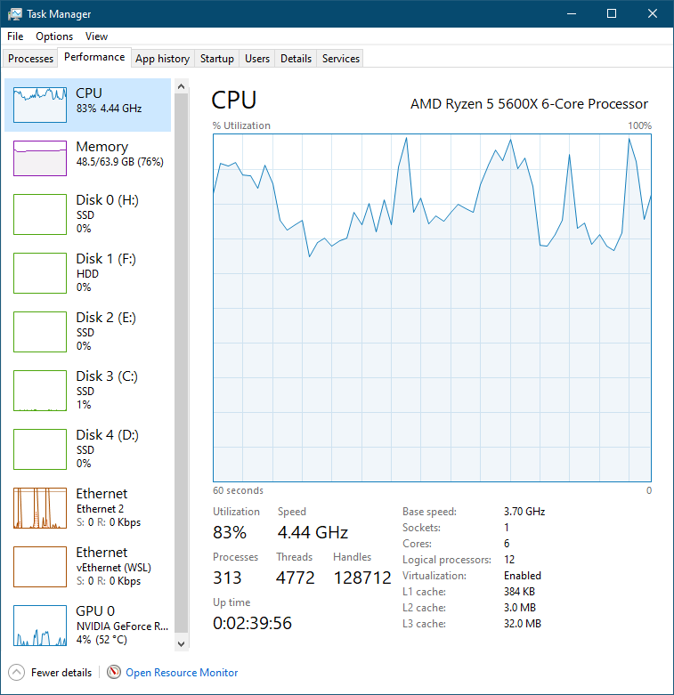

# VQGAN+CLIP experiments

In November 2021, my discord server exploded with hilarious experiments with
neuralblender.com. Naturally, I was curious about what ML tech was powering the
service, and wondered whether I could at least run it locally... or even serve
an instance myself for continued fun with my friends.

The blog at neuralblender.com doesn't really explain what they're doing, but a 
little casual searching on the internet suggested that VQGAN+CLIP is probably a
good place to start.

**DISCLAIMER: I am not an expert in this. This page is mostly a loose list of
things that I did in order to get it working. You take full responsibility if 
something goes belly up while following this document.**

## Step 0: What I'm working from

My searching turned up a post on adafruit called [Generating AI "Art" with VQGAN+CLIP](https://learn.adafruit.com/generating-ai-art-with-vqgan-clip)
It points you to this [Colab notebook](https://colab.research.google.com/drive/1go6YwMFe5MX6XM9tv-cnQiSTU50N9EeT),
which does a lot of magic behind the scenes, so that you only have to give it a
few easy parameters, and you'll get some trippy AI art after a bit of a wait.

For details on how to use the colab itself, I'm just going to point you [back
to the post](https://learn.adafruit.com/generating-ai-art-with-vqgan-clip/basic-use).
It's pretty straightforward.

By default, the colab connects to a free cloud-based runtime, which I assumed
to be a bit slow. I have an RTX 3090 that doesn't get enough use, so here are
the things I did to get the Colab running locally.

## Step 1: Get linux running on my machine

I didn't want to go through the hassle of dual-booting linux, or a [type 2
hypervisor](https://www.vmware.com/topics/glossary/content/hypervisor), so
decided to go the Windows Subsystems for Linux route, which is supposed to be 
quite stable these days.

1. This is actually pretty easy [docs](https://docs.microsoft.com/en-us/windows/wsl/install)

  ```powershell
  wsl --install
  ```

  I didn't bother to specify a distro. This is just an experiment, and I can
  always blow it away if I want to start again. 

  Things download and install. I have to restart my machine.

2. Naturally... I get an error:

  ```
  WslRegisterDistribution failed with error: 0x80370102
  Error: 0x80370102 The virtual machine could not be started because a required feature is not installed.
  ```

  Turns out this is because WSL needs Hyper-V (which I apparently don't have
  running). I thought WSL wasn't a VM, but what do I know? I just want to get
  this running. This turns out to require two things:

  *  Turn on Hyper-V in my BIOS (instructions are motherboard-specific).
  * Turn on the Hyper-V Windows feature.

3. One more reboot, and we have Ubuntu in a window.

4. The usual Ubuntu setup:
  * Create a non-root user.
  * Update the installed packages:
      ```bash
      sudo apt update
      sudo apt upgrade
      sudo apt autoremove
      ```

### WSL Pro tips
1. Install the [Windows Terminal](https://www.microsoft.com/en-au/p/windows-terminal/9n0dx20hk701#activetab=pivot:overviewtab)
   from the Microsoft Store. It is streets ahead of the windows Command Prompt, with support
   for multiple tabs, and direct access to your WSL shell, Powershell, etc.

2. You can access the WSL file system in Windows Explorer by browsing to `\\wsl$`.

## Step 2: Install Python 3.9

**WARNING: I think this manual install made life more difficult than it had to be.
I recommend AGAINST doing this. Just leaving it here for posterity.**

Ubuntu tends to be quite conservative with its package versions. As of this
writing, it offers Python 3.6, and I wanted to be a little more up to date.
Apparently [deadsnakes](https://launchpad.net/~deadsnakes/+archive/ubuntu/ppa)
is the accepted PPA for more up-to-date Python versions, since the Python team
doesn't maintain their own package repo.

```bash
sudo add-apt-repository ppa:deadsnakes/ppa
sudo apt update
sudo apt install python3.9
sudo apt install python3-pip
```

TODO: Maybe a discussion of the mess that is setting the default version of Python.
I'm not completely convinced it was necessary.

## Step 3: Install Jupyter

Jupyter is the local runtime that you'll connect the Colab to. What happens is that
the runtime creates a websockets server that Colab sends the commands to run to. 
The Google [documentation](https://research.google.com/colaboratory/local-runtimes.html)
has general information and instructions.

I think that I went the hard route installing JupyterLab. The first entry on
[their page ](https://jupyter.org/install) mentions `mamba` or `conda`, so
that's what I did. I think I should probably just have gone with `pip`.

1. Install miniforge to get `mamba`/`conda` by following [these steps](https://github.com/conda-forge/miniforge#install).

2. Install Jupyter:
```bash
mamba install -c conda-forge jupyterlab
```

At this point, I assumed that I was done, so I ran `jupyter-lab`, ignored some,
errors, and tried to connect Colab to the runtime. Stupid me, there's still stuff
to do first.

3. Generate a basic notebook config:

```bash
jupyter notebook --generate-config
```

You can have a poke in `~/.jupyter/jupyter_notebook_config.py` if you want to 
have a go at customising things, but there's nothing critical in there.

4. Return to the Google instructions and note that [you need](https://research.google.com/colaboratory/local-runtimes.html)
to install `jupyter_http_over_ws`:

```bash
pip install jupyter_http_over_ws
jupyter serverextension enable --py jupyter_http_over_ws
```

5. 

## Step 4: Start and connect to jupyter

1. Start the notebook

  ```bash
  jupyter notebook \
    --NotebookApp.allow_origin='https://colab.research.google.com' \
    --port=8888 \
    --NotebookApp.port_retries=0
  ```
  
  You may get an error about `Start : This command cannot be run due to the error: The system cannot find the file specified`.
  This is only relevant if you're going to use Jupyter's web frontend. You're
  using Google Colab, so you can ignore it.

 2. Connect Colab to Jupyter
 
   When it starts, the notebook will spit out a couple URLs like this:

  ```
       To access the notebook, open this file in a browser:
        file:///home/your_user/.local/share/jupyter/runtime/nbserver-31844-open.html
    Or copy and paste one of these URLs:
        http://localhost:8888/?token=blahblahblah
     or http://127.0.0.1:8888/?token=blahblahblah
  ```

   In your Colab window, go to "Connect to local runtime", and enter the URL `http://localhost:8888/?token=blahblahblah`.
   When you hit "Connect", it should connect to your machine, and you can start running the Colab.

   Go back to that adafruit [article](https://learn.adafruit.com/generating-ai-art-with-vqgan-clip/basic-use)
   for instructions.

## Step 5: Dependencies breaking in your runtime?

On my first official run, the colab stumbled in the `Hacer la ejecución...`
section with some python `ImportError`s. The cell `Instalación de bibliotecas`
actually installs a bunch of dependencies, but silently fails if there's a 
problem. I found it best to install the following manually so that they are
permanently there:

```
sudo apt install exempi ffmpeg
pip install ftfy regex tqdm omegaconf pytorch-lightning
pip install kornia
pip install einops
pip install wget
pip install stegano
pip install python-xmp-toolkit
pip install imgtag
pip install pillow
pip install imageio-ffmpeg
```

## Step 6: Run it on your GPU

**NOTE: cuda only works on WSL if your're on the Windows Insider track. I have
now reached my threshold for instability risk on my system, so I have not 
proceeded any further beyond this point.**

If you're looking at Task Manager, you might notice something weird:

 

I've got an RTX3090. Why am I doing ML tasks and not using those sweet, sweet
Tensor cores?

NOTE: I only have an NVIDIA card, which uses cuda, and that seems to be of
choice for ML work.

So I noticed this in the output of the `Hacer la ejecución...` cell:

```
Using device: cpu
```

And you can see how that happens in the source of that cell:

```python
device = torch.device('cuda:0' if torch.cuda.is_available() else 'cpu')
print('Using device:', device)
```

If you jump into python, you can verify:

```python
>>> import torch
>>> torch.cuda.is_available()
False
```

Fortunately, somebody's already done the hard work, and documented [5 Steps to
Install PyTorch With CUDA 10.0](https://varhowto.com/install-pytorch-cuda-10-0/).

The prerequisite there is to get CUDA 10.0 installed first. NVIDIA has some
[WSL-specific instructions](https://docs.nvidia.com/cuda/wsl-user-guide/index.html#installing-nvidia-drivers).

1. Install a version of the [NVIDIA display drivers](https://developer.nvidia.com/cuda/wsl/download)
that contains the CUDA software.
2. Add the `cuda` repo to your apt sources

```bash
wget https://developer.download.nvidia.com/compute/cuda/repos/wsl-ubuntu/x86_64/cuda-wsl-ubuntu.pin
sudo mv cuda-wsl-ubuntu.pin /etc/apt/preferences.d/cuda-repository-pin-600
sudo apt-key adv --fetch-keys https://developer.download.nvidia.com/compute/cuda/repos/wsl-ubuntu/x86_64/7fa2af80.pub
sudo add-apt-repository "deb https://developer.download.nvidia.com/compute/cuda/repos/wsl-ubuntu/x86_64/ /"
sudo apt-get update
sudo apt-get -y install cuda
```

Is it working?
```python
>>> import torch
>>> torch.cuda.is_available()
False
```

Hmm. Maybe reinstall torch?

```bash
conda install pytorch torchvision cudatoolkit -c pytorch
```

